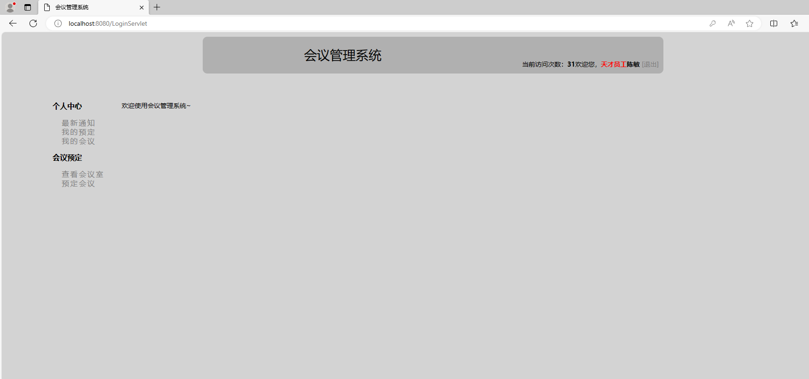
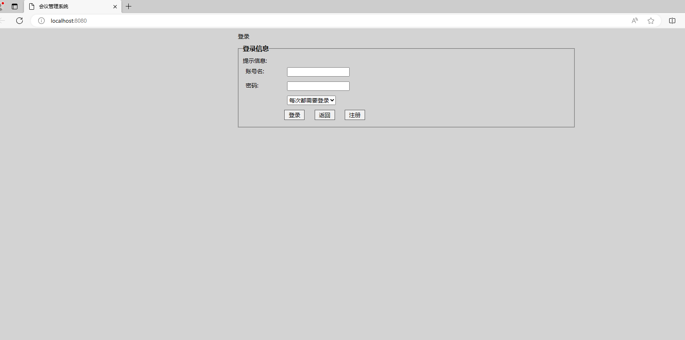
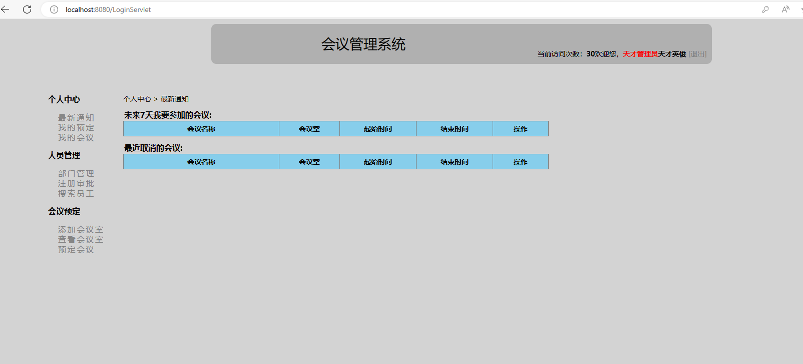

# meeting-system

Jsp+Servlet+JavaBean的会议管理系统

角色：管理，普通员工

部门，会议记录

员工端

个人中心

- [最新通知](http://localhost:8080/01.html)
- [我的预定](http://localhost:8080/01.html)
- [我的会议](http://localhost:8080/01.html)

会议预定

- [查看会议室](http://localhost:8080/01.html)
- [预定会议](http://localhost:8080/01.html)

管理员端

个人中心

- [最新通知](http://localhost:8080/MyNotificationServlet)
- [我的预定](http://localhost:8080/ViewMyBookingServlet)
- [我的会议](http://localhost:8080/ViewMyMeetingsServlet)

人员管理

- [部门管理](http://localhost:8080/ViewAllDepartmentsServlet?code=viewalldepartments)
- [注册审批](http://localhost:8080/ViewAllEmployeesServlet?code=approve)
- [搜索员工](http://localhost:8080/searchemployees.jsp)

会议预定

- [添加会议室](http://localhost:8080/addmeetingroom.jsp)
- [查看会议室](http://localhost:8080/ViewAllMeetingRoomsServlet)
- [预定会议](http://localhost:8080/BookMeetingServlet?code=prepare)

数据库就在根目录下:meeting.sql
修改成自己的数据库账号与密码
在   com.meeting.util那里
      //获得链接
			conn = DriverManager.getConnection("jdbc:mysql://localhost:3306/数据库名?useUnicode=true&characterEncoding=utf8", "用户", "密码");

运行环境:
idea+ java8  +Tomcat8.0

